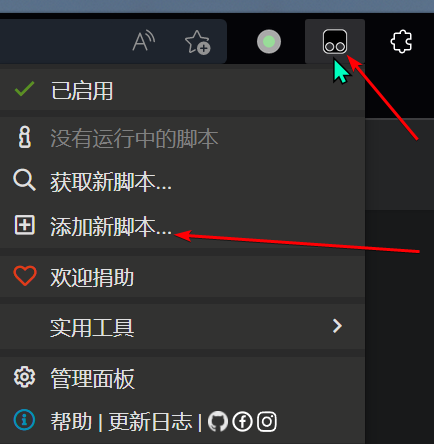
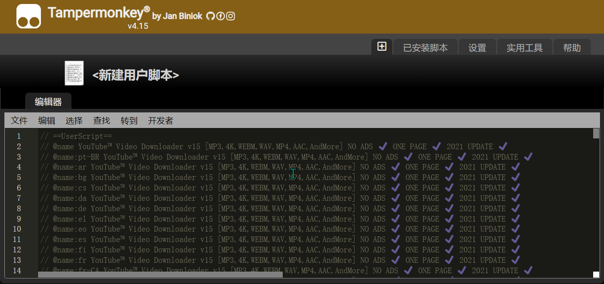
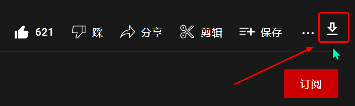
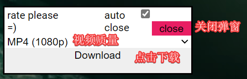

## 前言

我在2020年上传的一个[油管视频下载教程](https://www.bilibili.com/video/BV1r64y1M7UA/)收获了还算可以的播放量, 时常能收到一些观众的点赞

但现在已经是2022年了, 教程中所使用的方法已经不太适用了, 至少从我自己的尝试和其他观众的反馈来看是这样的

经常会出现下载速度为0, 或者下载速度太慢之类的情况

所以我找了个新的, **现在**我自己试下来好像还有点效果的方法


## 安装油猴脚本

第一步是在浏览器上安装插件--油猴脚本(Tampermonkey)

[微软商店](https://microsoftedge.microsoft.com/addons/detail/tampermonkey/iikmkjmpaadaobahmlepeloendndfphd)

[谷歌商店](https://chrome.google.com/webstore/detail/tampermonkey/dhdgffkkebhmkfjojejmpbldmpobfkfo)

如果上面的链接都点不进去, 那么不建议继续操作下去了, 因为你大概连油管都上不去, 看了也是白看

## 找一个合适的脚本

我之前在[脚本站](https://greasyfork.org/zh-CN)找到一个挺好用的脚本, 但不知为啥, 最近去看的时候又找不到了

但还好这些脚本都是用 `js` 写的, 所以我先贴一下这个脚本, 脚本有点长, 为了不影响观感, 已折叠

<details>

<summary>被折叠的脚本代码</summary>

```js
// ==UserScript==
// @name YouTube™ Video Downloader v15 [MP3,4K,WEBM,WAV,MP4,AAC,AndMore] NO ADS ✔️ ONE PAGE ✔️ 2021 UPDATE ✔️
// @name:pt-BR YouTube™ Video Downloader v15 [MP3,4K,WEBM,WAV,MP4,AAC,AndMore] NO ADS ✔️ ONE PAGE ✔️ 2021 UPDATE ✔️
// @name:ar YouTube™ Video Downloader v15 [MP3,4K,WEBM,WAV,MP4,AAC,AndMore] NO ADS ✔️ ONE PAGE ✔️ 2021 UPDATE ✔️
// @name:bg YouTube™ Video Downloader v15 [MP3,4K,WEBM,WAV,MP4,AAC,AndMore] NO ADS ✔️ ONE PAGE ✔️ 2021 UPDATE ✔️
// @name:cs YouTube™ Video Downloader v15 [MP3,4K,WEBM,WAV,MP4,AAC,AndMore] NO ADS ✔️ ONE PAGE ✔️ 2021 UPDATE ✔️
// @name:da YouTube™ Video Downloader v15 [MP3,4K,WEBM,WAV,MP4,AAC,AndMore] NO ADS ✔️ ONE PAGE ✔️ 2021 UPDATE ✔️
// @name:de YouTube™ Video Downloader v15 [MP3,4K,WEBM,WAV,MP4,AAC,AndMore] NO ADS ✔️ ONE PAGE ✔️ 2021 UPDATE ✔️
// @name:el YouTube™ Video Downloader v15 [MP3,4K,WEBM,WAV,MP4,AAC,AndMore] NO ADS ✔️ ONE PAGE ✔️ 2021 UPDATE ✔️
// @name:eo YouTube™ Video Downloader v15 [MP3,4K,WEBM,WAV,MP4,AAC,AndMore] NO ADS ✔️ ONE PAGE ✔️ 2021 UPDATE ✔️
// @name:es YouTube™ Video Downloader v15 [MP3,4K,WEBM,WAV,MP4,AAC,AndMore] NO ADS ✔️ ONE PAGE ✔️ 2021 UPDATE ✔️
// @name:fi YouTube™ Video Downloader v15 [MP3,4K,WEBM,WAV,MP4,AAC,AndMore] NO ADS ✔️ ONE PAGE ✔️ 2021 UPDATE ✔️
// @name:fr YouTube™ Video Downloader v15 [MP3,4K,WEBM,WAV,MP4,AAC,AndMore] NO ADS ✔️ ONE PAGE ✔️ 2021 UPDATE ✔️
// @name:fr-CA YouTube™ Video Downloader v15 [MP3,4K,WEBM,WAV,MP4,AAC,AndMore] NO ADS ✔️ ONE PAGE ✔️ 2021 UPDATE ✔️
// @name:he YouTube™ Video Downloader v15 [MP3,4K,WEBM,WAV,MP4,AAC,AndMore] NO ADS ✔️ ONE PAGE ✔️ 2021 UPDATE ✔️
// @name:hu YouTube™ Video Downloader v15 [MP3,4K,WEBM,WAV,MP4,AAC,AndMore] NO ADS ✔️ ONE PAGE ✔️ 2021 UPDATE ✔️
// @name:id YouTube™ Video Downloader v15 [MP3,4K,WEBM,WAV,MP4,AAC,AndMore] NO ADS ✔️ ONE PAGE ✔️ 2021 UPDATE ✔️
// @name:it YouTube™ Video Downloader v15 [MP3,4K,WEBM,WAV,MP4,AAC,AndMore] NO ADS ✔️ ONE PAGE ✔️ 2021 UPDATE ✔️
// @name:ja YouTube™ Video Downloader v15 [MP3,4K,WEBM,WAV,MP4,AAC,AndMore] NO ADS ✔️ ONE PAGE ✔️ 2021 UPDATE ✔️
// @name:ko YouTube™ Video Downloader v15 [MP3,4K,WEBM,WAV,MP4,AAC,AndMore] NO ADS ✔️ ONE PAGE ✔️ 2021 UPDATE ✔️
// @name:nb YouTube™ Video Downloader v15 [MP3,4K,WEBM,WAV,MP4,AAC,AndMore] NO ADS ✔️ ONE PAGE ✔️ 2021 UPDATE ✔️
// @name:nl YouTube™ Video Downloader v15 [MP3,4K,WEBM,WAV,MP4,AAC,AndMore] NO ADS ✔️ ONE PAGE ✔️ 2021 UPDATE ✔️
// @name:pl YouTube™ Video Downloader v15 [MP3,4K,WEBM,WAV,MP4,AAC,AndMore] NO ADS ✔️ ONE PAGE ✔️ 2021 UPDATE ✔️
// @name:ro YouTube™ Video Downloader v15 [MP3,4K,WEBM,WAV,MP4,AAC,AndMore] NO ADS ✔️ ONE PAGE ✔️ 2021 UPDATE ✔️
// @name:ru YouTube™ Video Downloader v15 [MP3,4K,WEBM,WAV,MP4,AAC,AndMore] NO ADS ✔️ ONE PAGE ✔️ 2021 UPDATE ✔️
// @name:sk YouTube™ Video Downloader v15 [MP3,4K,WEBM,WAV,MP4,AAC,AndMore] NO ADS ✔️ ONE PAGE ✔️ 2021 UPDATE ✔️
// @name:sr YouTube™ Video Downloader v15 [MP3,4K,WEBM,WAV,MP4,AAC,AndMore] NO ADS ✔️ ONE PAGE ✔️ 2021 UPDATE ✔️
// @name:sv YouTube™ Video Downloader v15 [MP3,4K,WEBM,WAV,MP4,AAC,AndMore] NO ADS ✔️ ONE PAGE ✔️ 2021 UPDATE ✔️
// @name:th YouTube™ Video Downloader v15 [MP3,4K,WEBM,WAV,MP4,AAC,AndMore] NO ADS ✔️ ONE PAGE ✔️ 2021 UPDATE ✔️
// @name:tr YouTube™ Video Downloader v15 [MP3,4K,WEBM,WAV,MP4,AAC,AndMore] NO ADS ✔️ ONE PAGE ✔️ 2021 UPDATE ✔️
// @name:uk YouTube™ Video Downloader v15 [MP3,4K,WEBM,WAV,MP4,AAC,AndMore] NO ADS ✔️ ONE PAGE ✔️ 2021 UPDATE ✔️
// @name:ug YouTube™ Video Downloader v15 [MP3,4K,WEBM,WAV,MP4,AAC,AndMore] NO ADS ✔️ ONE PAGE ✔️ 2021 UPDATE ✔️
// @name:vi YouTube™ Video Downloader v15 [MP3,4K,WEBM,WAV,MP4,AAC,AndMore] NO ADS ✔️ ONE PAGE ✔️ 2021 UPDATE ✔️
// @name:zh-CN YouTube™ Video Downloader v15 [MP3,4K,WEBM,WAV,MP4,AAC,AndMore] NO ADS ✔️ ONE PAGE ✔️ 2021 UPDATE ✔️
// @name:zh-TW YouTube™ Video Downloader v15 [MP3,4K,WEBM,WAV,MP4,AAC,AndMore] NO ADS ✔️ ONE PAGE ✔️ 2021 UPDATE ✔️
// @name:ru YouTube™ Video Downloader v15 [MP3,4K,WEBM,WAV,MP4,AAC,AndMore] NO ADS ✔️ ONE PAGE ✔️ 2021 UPDATE ✔️
// @description Downloads video and audio from YouTube. Fast and efficient! Doesn't redirect to other pages!
// @description:pt-BR Baixa vídeos e áudios do YouTube. Rápido e eficiente! Não redireciona para outras páginas!
// @description:ar تنزيل الفيديو والصوت من يوتيوب. سريع وفعال! لا إعادة توجيه إلى صفحات أخرى!
// @description:bg Изтегля видео и аудио от YouTube. Бързо и ефективно! Не пренасочва към други страници!
// @description:cs Stahuje video a audio z YouTube. Rychle a efektivně! Přesměruje na jiné stránky!
// @description:da Do .nloader video og lyd fra YouTube. Hurtig og effektiv! Omdirigerer ikke til andre sider!
// @description:de Lädt Videos und Audio von YouTube herunter. Schnell und effizient! Keine Umleitungen zu anderen Seiten!
// @description:el Λήψεις βίντεο και ήχου από το YouTube. Γρήγορη και αποτελεσματική! Δεν ανακατευθύνει σε άλλες σελίδες!
// @description:eo Elŝutoj video kaj aŭdio de YouTube. Rapida kaj efika! Ne redirect al aliaj paĝoj!
// @description:es Descarga videos y audios de YouTube. ¡Rápido y eficiente! No redirige a otras páginas!
// @description:fi Lataa videota ja ääntä YouTubesta. Nopea ja tehokas! Ei ohjaa muille sivuille!
// @description:fr Télécharge des vidéos et de l'audio à partir de YouTube. Rapide et efficace! Ne pas rediriger vers d'autres pages!
// @description:fr-CA Télécharge des vidéos et de l'audio à partir de YouTube. Rapide et efficace! Ne pas rediriger vers d'autres pages!
// @description:he מוריד וידאו ושמע מ-YouTube. מהיר ויעיל! לא מפנה מחדש לדפים אחרים!
// @description:hu Letöltések videó és hang a YouTube-on. Gyors és hatékony! Nem átirányítja más oldalakra!
// @description:id Muat turun video dan audio dari YouTube. Cepat dan yang cekap! Tidak mengarahkan ke halaman lain!
// @description:it Scarica Video e audio da YouTube. Veloce ed efficiente! Non reindirizza ad altre pagine!
// @description:ja YouTubeからビデオとオーディオをダウンロードします。 高速かつ効率的！ 他のページにリダイレクトしません！
// @description:ko YouTube 에서 비디오 및 오디오를 다운로드합니다. 빠르고 효율적인! 다른 페이지로 리디렉션하지 않습니다!
// @description:nb Last ned videoer og lyd fra YouTube. Rask og effektiv! Ikke viderekobler til en annen side!
// @description:nl Download videos and audio from YouTube. Fast and efficient! Do not redirect to another page!
// @description:pl Pobierz Filmy i audio z YouTube. Szybko i sprawnie! Nie przekierowuj na inną stronę!
// @description:ro Descărcați video și audio de pe YouTube. Rapid și eficient! Nu redirecționați către o altă pagină!
// @description:ru Загружает видео и аудио с YouTube. Быстро и эффективно! Не перенаправляет на другие страницы!
// @description:sk Sťahovanie videa a zvuku z YouTube. Rýchla a efektívna! Nie je presmerovanie na iné stránky!
// @description:sr Preuzmite video i audio s YouTubea. Brzo i učinkovito! Nemojte preusmjeravati na druge web stranice!
// @description:sv Ladda ner video och ljud från YouTube. Snabbt och effektivt! Omdirigera inte till andra webbplatser!
// @description:th การดาวน์โหลดวิดีโอและเสียงมาจากยูทูปน่ะ อย่างรวดเร็วและมีประสิทธิภาพเพียงพอ smooth scrolling! ยังไม่เปลี่ยนปลายทางจดหมายไปอีกหน้า!
// @description:tr Youtube'dan video ve ses indirir. Hızlı ve verimli! Diğer sayfalara yönlendirmiyor!
// @description:uk Завантажує відео та аудіо з YouTube. Швидко і ефективно! Не перенаправляє на інші сторінки!
// @description:ug تنزيل الفيديو والصوت من يوتيوب. سريع وفعال! لا إعادة توجيه إلى صفحات أخرى!
// @description:vi Phổ biến video và âm thanh từ YouTube. Nhanh chóng và hiệu quả! Không chuyển hướng sang trang khác!
// @description:zh-CN 从YouTube下载视频和音频。 快速高效！ 不重定向到其他页面！
// @description:zh-TW 从YouTube下载视频和音频。 快速高效！ 不重定向到其他页面！
// @namespace    http://tampermonkey.net/
// @version      15
// @author       Anpkal_Zuev
// @match        https://www.youtube.com/*
// @icon         https://www.google.com/s2/favicons?domain=youtube.com
// @grant        GM_xmlhttpRequest
// @compatible chrome
// @compatible firefox
// @compatible opera
// @compatible safari
// @compatible edge
// @connect      googuu.xyz
// @connect      loader.to
// @connect      oceansaver.in
// @license      MIT
// ==/UserScript==

// Copyright (c) 2021 Anpkal Zuev and others

// Permission is hereby granted, free of charge, to any person obtaining
// a copy of this software and associated documentation files (the
// "Software"), to deal in the Software without restriction, including
// without limitation the rights to use, copy, modify, merge, publish,
// distribute, sublicense, and/or sell copies of the Software, and to
// permit persons to whom the Software is furnished to do so, subject to
// the following conditions:

// The above copyright notice and this permission notice shall be
// included in all copies or substantial portions of the Software.

// THE SOFTWARE IS PROVIDED "AS IS", WITHOUT WARRANTY OF ANY KIND,
// EXPRESS OR IMPLIED, INCLUDING BUT NOT LIMITED TO THE WARRANTIES OF
// MERCHANTABILITY, FITNESS FOR A PARTICULAR PURPOSE AND
// NONINFRINGEMENT. IN NO EVENT SHALL THE AUTHORS OR COPYRIGHT HOLDERS BE
// LIABLE FOR ANY CLAIM, DAMAGES OR OTHER LIABILITY, WHETHER IN AN ACTION
// OF CONTRACT, TORT OR OTHERWISE, ARISING FROM, OUT OF OR IN CONNECTION
// WITH THE SOFTWARE OR THE USE OR OTHER DEALINGS IN THE SOFTWARE.

window.onload = function () {
    var dark = !!document.getElementsByTagName("html")[0].getAttribute("dark");
    var downloadIcon = `<svg xmlns="http://www.w3.org/2000/svg" height="24px" viewBox="0 0 24 24" width="24px" fill="#000000" style="margin-top: 5px;"><path d="M0 0h24v24H0V0z" fill="none"></path><path d="M13 5v6h1.17L12 13.17 9.83 11H11V5h2m2-2H9v6H5l7 7 7-7h-4V3zm4 15H5v2h14v-2z"></path></svg>`;
    if (dark) {
        downloadIcon = `<svg xmlns="http://www.w3.org/2000/svg" height="24px" viewBox="0 0 24 24" width="24px" fill="#FFFFFF"><path d="M0 0h24v24H0V0z" fill="none"/><path d="M19 9h-4V3H9v6H5l7 7 7-7zm-8 2V5h2v6h1.17L12 13.17 9.83 11H11zm-6 7h14v2H5z"/></svg>`;
    }
    var programSTATUS = 0;
    function startload () {
        var format = document.getElementById("formatus").value;
        var f = format;
        if (f == "8k" || f == "4k" || f == "1080" || f == "720" || f == "480" || f == "360") {
            f = "mp4";
        }
        getFORMVIDEO(format, f);
    }


    function updatepos (one, two) {
        var reproz = 100 / two;
        var ttproz = reproz * one;
        document.getElementById("download21").innerText = "Downloaded: " + Math.trunc(ttproz * 10) / 10 + "%";
        if (Math.trunc(ttproz * 10) / 10 == 100) {
            document.getElementById("download21").innerText = "Download";
        }
    }

    function getFORMVIDEO (format, fff) {
        var link = `https://loader.to/ajax/download.php?start=1&end=1&format=` + format + `&url=` + encodeURI(window.location.href);
        GM_xmlhttpRequest({
            method: 'GET',
            url: link,
            responseType: "json",
            onload: function () {
                var ide = this.response.id;
                var gtitle = this.response.title;

                checkStatus();
                function checkStatus () {
                    GM_xmlhttpRequest({
                        method: 'GET',
                        url: "https://loader.to/ajax/progress.php?id=" + ide,
                        responseType: "json",
                        onload: function () {
                            document.getElementById("download21").innerText = " preparation: " + "" + this.response.progress / 10 + "%";
                            if (this.response.text != "Finished") {
                                setTimeout(() => { checkStatus(); }, 800);
                            } else {
                                download(this.response.download_url, gtitle, fff);
                            }
                        }
                    });
                }
            }
        });

    }
    function download (link, name, type) {
        window.location.href = link;
        programSTATUS = 0;
        document.getElementById("download21").innerText = "Download";
        /*
        GM_xmlhttpRequest({
            method: 'GET',
            url: link,
            responseType:"blob",
            onload: function() {
                console.log(1);
                save([this.response], name+"."+type);
                },
            onprogress:function(r) {
                updatepos(r.loaded,r.totalSize)
            }
        });
        */
    }
    var save = (function () {
        var a = document.createElement("a");
        document.body.appendChild(a);
        a.style = "display: none";
        return function (data, name) {
            programSTATUS = 0;
            var blob = new Blob(data, { type: "octet/stream" }),
                url = window.URL.createObjectURL(blob);
            a.href = url;
            a.download = name;
            a.click();
            window.URL.revokeObjectURL(url);
            if (document.getElementById("ON125374").checked) {
                showsettingsd();
                localStorage.setItem('ACLOSE154658', '1');
            }
        };
    }());
    var menu15 = `
<div style="
  width: 250px;
  height: 89px;
  background-color: white;
  margin-left: calc(100vw/2 - 250px/2);
  margin-top: calc(100vh/2 - 89px/2);
  outline: 2px solid #000;
  padding: 0px;
"><div style="height: 19px;">
<div style="
  width: 84px;
  float: left;
  margin-left: 4px;
  margin-top: 2px;
">rate please =)</div><div style="
  width: 50px;
  float: left;
  margin-left: 4px;
  margin-top: 2px;
  margin-left: 46px;
">auto close</div><input type="checkbox" id="ON125374" style="
  margin-left: -1px;
"><button id="slaves" style="
  border-radius: 0px;
  float: right;
  border-width: 2px;
  border: 0px;
  height: 19px;
  background-color: #e91e63;
">&nbsp;close&nbsp;</button></div><div style="
  height: 17px;
"><select id="formatus" style="
  width: 250px;
  border-width: 0px;
  background-color: #fff;
"><optgroup label="Audio">
<option value="mp3">MP3</option>
<option value="m4a">M4A</option>
<option value="webm">WEBM</option>
<option value="aac">AAC</option>
<option value="flac">FLAC</option>
<option value="opus">OPUS</option>
<option value="ogg">OGG</option>
<option value="wav">WAV</option>
</optgroup><optgroup label="Video">
<option value="360">MP4 (360 px)</option>
<option value="480">MP4 (480 px)</option>
<option value="720">MP4 (720p)</option>
<option value="1080" selected="selected">MP4 (1080p)</option>
<option value="1440">MP4 (1440p)</option>
<option value="4k">WEBM (4K)</option>
<option value="8k">WEBM (8K)</option></optgroup></select></div><button id="download21" style="
  border-radius: 0px;
  float: right;
  border-width: 2px;
  width: 100%;
  height: 53px;
  border: 0;
">Download</button></div>
`;
    function showsettingsd () {
        var lay = document.getElementsByClassName("15674821765123")[0];
        var pos = lay.style.display;
        lay.style.display = (pos == "none" ? "block" : "none");
    }
    setListener();
    function setListener () {
        try {
            document.getElementById("slaves").onclick = function () {
                showsettingsd();
            };
            document.getElementsByClassName("14221212455")[0].onclick = function () {
                showsettingsd();
            };
            document.getElementById("download21").onclick = function () {
                if (!programSTATUS) {
                    startload();
                    programSTATUS = 1;
                } else {
                    alert("The video is still loading..");
                }
            };
            document.getElementById("ON125374").onclick = function () {
                if (document.getElementById("ON125374").checked) {
                    localStorage.setItem('ACLOSE154658', '1');
                } else {
                    localStorage.setItem('ACLOSE154658', '0');
                }
            };
        } catch { setTimeout(() => { setListener(); }, 500); }
    }
    let div = document.createElement("div");
    div.className = "14221212455";
    div.innerHTML = downloadIcon;
    try { setTimeout(() => { document.getElementsByClassName("style-scope ytd-video-primary-info-renderer")[8].append(div); }, 1000); }
    catch {
        try { setTimeout(() => { document.getElementsByClassName("style-scope ytd-video-primary-info-renderer")[8].append(div); }, 1000); }
        catch {
            setTimeout(() => { document.getElementsByClassName("style-scope ytd-video-primary-info-renderer")[8].append(div); }, 1000);
        }
    }
    let div1 = document.createElement('div');
    div1.className = "15674821765123";
    div1.innerHTML = menu15;
    div1.style = `width: 100vw;background-color: #00000024;height: 100vh;position: fixed;right: 5px;display: none;z-index:99999999;`;
    document.body.prepend(div1);

    if (!!Number(localStorage.getItem("ACLOSE154658"))) {
        document.getElementById("ON125374").click();
    }

};
```

</details>

复制上面的脚本, 然后点击浏览器中油猴脚本插件图标, 选择添加新脚本



然后用复制的脚本覆盖掉打开的页面中的脚本代码



复制粘贴完成之后按快捷键 `ctrl+s` 保存即可

## 下载视频

脚本添加完成后打开你想要下载的[油管视频](https://www.youtube.com/watch?v=GTE7hMOTcQ4)

然后在订阅按钮上方, 点赞按钮同一行的地方 **应当** 会出现一个下载按钮



如果没有, 那就刷新, 如果还没有, 那就多刷新几次, 如果确实还是没有, 有可能这套方案就寄了

点击下载的按钮之后会出现一个如下的弹窗



默认选项的视频中会带音频, 如果有其他的需求也可以自己选择

确认后点击download, 后面会出现perparation: 23.3% 之类的字样, 等到加载至100%后会自动弹出下载, 然后自己找个位置保存一下就好了

如果这个方案的速度也不行了, 那么很有可能就是寄了
