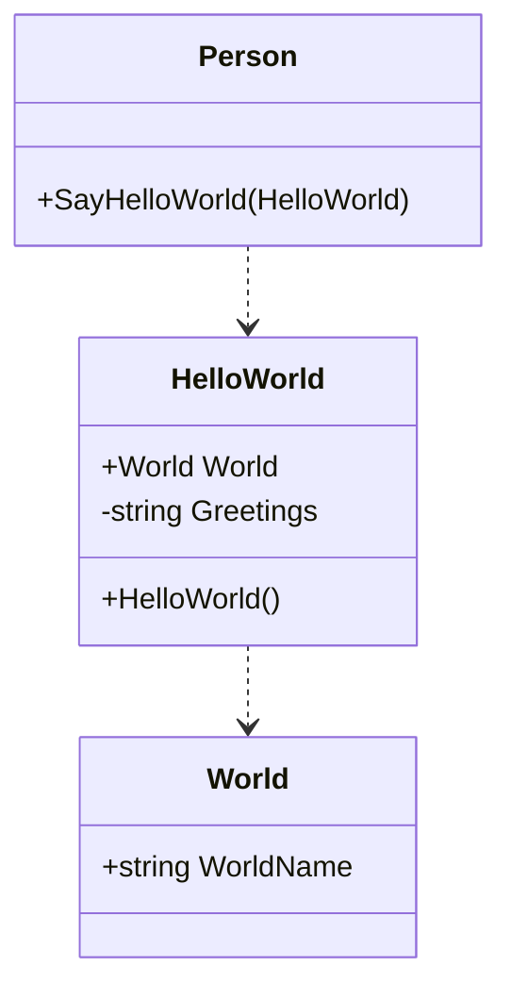

## 类图

```text
    ```mermaid
    classDiagram

    class Person{
        +SayHelloWorld(HelloWorld)
    }
    class HelloWorld{
        +World World
        -string Greetings
        +HelloWorld()
    }
    class World{
        +string WorldName
    }

    Person ..> HelloWorld
    HelloWorld ..> World
    ```
```



