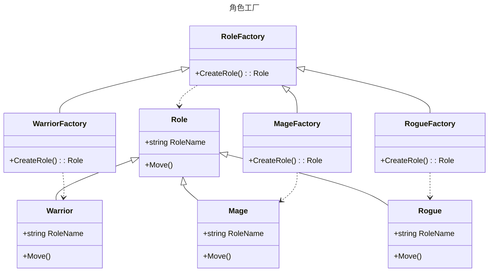

工厂方法模式是一种**创建型**设计模式, 提供一种统一的方式来创建对象, 调用者无需关心具体的构建细节

对象的创建过程被封装在工厂类中, 调用者只需要使用一个共同的接口来获取对象, 不需要直接使用new操作符

这样可以降低客户端和具体产品类之间的耦合度, 提高系统的可扩展性和可维护性

## 工厂方法模式的作用

* 定义统一的工厂接口, 实现了对象创建和使用的分离, 让客户端不需要知道具体的产品类名, 只需要知道产品所属的工厂即可
* 可以根据不同的需求和环境, 动态地选择具体的产品类来创建对象, 增加了系统的灵活性
* 可以对产品进行统一的管理和配置, 方便后期维护和升级
* 可以解耦对象的创建和使用过程, 把对象的实例化交给工厂类
* 可以灵活应对变化的业务需求, 方便代码管理、避免代码重复
* ......

## 工厂方法模式适用于什么场景

当一个类不知道或者不关心它需要创建的对象的具体细节时, 可以使用工厂方法模式

例如, 游戏在开始的时候需要创建一个角色, 但是不知道具体要创建哪种角色(如战士、法师、盗贼等, 角色的选择可能是在这个流程开始之前确定下来的), 同样也不知道创建这些对象都需要什么条件, 这种情况下就可以考虑使用工厂方法模式, 让子类工厂(例如战士工厂)来创建角色

## 类图



## 代码

定义角色

```csharp
public abstract class Role
{
    protected Role(string RoleName) => this.RoleName = RoleName;
    public string RoleName { get; set; }
    public abstract void Move();
}
public class Warrior : Role
{
    public Warrior() : base("战士") { }
    public override void Move() => Console.WriteLine($"{RoleName}开着野蛮冲锋跑路");
}
public class Mage : Role
{
    public Mage() : base("法师") { }
    public override void Move() => Console.WriteLine($"{RoleName}开着疾风术跑路");
}
public class Rogue : Role
{
    public Rogue() : base("盗贼") { }
    public override void Move() => Console.WriteLine($"{RoleName}开着潜行跑路");
}
```

然后定义对应的角色工厂

```csharp
public abstract class RoleFactory
{
    public abstract Role CreateRole();
}
public class WarriorFactory : RoleFactory
{
    public override Role CreateRole() => new Warrior();
}
public class MageFactory : RoleFactory
{
    public override Role CreateRole() => new Mage();
}
public class RogueFactory : RoleFactory
{
    public override Role CreateRole() => new Rogue();
}
```

## 如何去使用

```csharp
RoleFactory factory = new MageFactory();
var player = factory.CreateRole();
player.Move();

factory = new RogueFactory();
player = factory.CreateRole();
player.Move();
```
两次`Move`的输出为

**法师开着疾风术跑路**

**盗贼开着潜行跑路**

在这种时候可能看不出工厂模式的作用, 下面是一个简单的代码演示

```csharp
new 山洞副本(new MageFactory()).危险发生();

class 山洞副本
{
    private Role Player;
    private readonly RoleFactory factory;
    public 山洞副本(RoleFactory factory)
    {
        this.factory = factory;
        Init();
    }

    private void Init()
    {
        Console.WriteLine("开始初始化");
        Player = factory.CreateRole();
        Console.WriteLine($"成功加载 {Player.RoleName}");
    }

    public void 危险发生()
    {
        Console.WriteLine("出现大群野生篮球");
        Player.Move();
        if (DateTime.Now.DayOfWeek == DayOfWeek.Thursday)
        {
            Console.WriteLine("今天是逃不过的肯德基疯狂星期四");
            Console.WriteLine($"角色{Player.RoleName} 死亡，重新初始化");
            Init();
        }
        else
        {
            Console.WriteLine("成功逃脱了！");
        }
    }
}
```

创建副本时传入角色工厂, 初始化副本数据的时候由工厂创建角色, 当危险发生时触发玩家角色的`跑路`方法, 如果周四就逃跑失败重新初始化角色, 副本并不需要知道创建角色的细节, 这些细节都被封装在了工厂中

在这种情况下, 即使以后有新增加的角色, 比如平民,游侠什么的, 只需要实现对应的工厂和角色类, 然后在创建副本的时候修改传入的工厂即可, **山洞副本是不需要做任何改动的**

