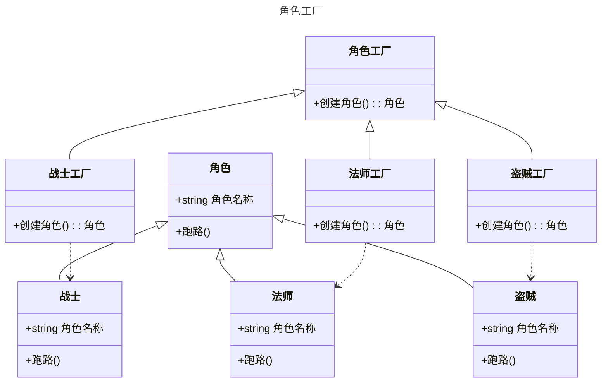

工厂方法模式是一种**创建型**设计模式, 提供一种统一的方式来创建对象, 调用者无需关心具体的构建细节
对象的创建过程被封装在工厂类中, 调用者只需要使用一个共同的接口来获取对象, 不需要直接使用new操作符
这样可以降低客户端和具体产品类之间的耦合度, 提高系统的可扩展性和可维护性

## 工厂方法模式的作用

* 定义统一的工厂接口, 实现了对象创建和使用的分离, 让客户端不需要知道具体的产品类名, 只需要知道产品所属的工厂即可
* 可以根据不同的需求和环境, 动态地选择具体的产品类来创建对象, 增加了系统的灵活性
* 可以对产品进行统一的管理和配置, 方便后期维护和升级
* 可以解耦对象的创建和使用过程, 把对象的实例化交给工厂类
* 可以灵活应对变化的业务需求, 方便代码管理、避免代码重复
* ......

## 工厂方法模式适用于什么场景

当一个类不知道或者不关心它需要创建的对象的具体类型时, 可以使用工厂方法模式

例如, 游戏在开始的时候需要创建一个角色, 但是不知道具体要创建哪种角色(如战士、法师、盗贼等, 角色的选择可能是在这个流程开始之前确定下来的), 这种情况下就可以考虑使用工厂方法模式, 让子类工厂(例如战士工厂)来决定创建哪种角色

## 类图



## 代码

~~虽然很怪, 但还是先用中文编码吧, 看懂应该不难~~

定义角色

```csharp
public abstract class 角色
{
    protected 角色(string 角色名称) => this.角色名称 = 角色名称;
    public string 角色名称 { get; set; }
    public abstract void 跑路();
}
public class 战士 : 角色
{
    public 战士() : base("战士") { }
    public override void 跑路() => Console.WriteLine($"{角色名称}开着野蛮冲锋跑路");
}
public class 法师 : 角色
{
    public 法师() : base("法师") { }
    public override void 跑路() => Console.WriteLine($"{角色名称}开着疾风术跑路");
}
public class 盗贼 : 角色
{
    public 盗贼() : base("盗贼") { }
    public override void 跑路() => Console.WriteLine($"{角色名称}开着潜行跑路");
}
```

定义角色工厂

```csharp
public abstract class 角色工厂
{
    public abstract 角色 创建角色();
}
public class 战士工厂 : 角色工厂
{
    public override 角色 创建角色() => new 战士();
}
public class 法师工厂 : 角色工厂
{
    public override 角色 创建角色() => new 法师();
}
public class 盗贼工厂 : 角色工厂
{
    public override 角色 创建角色() => new 盗贼();
}
```

如何去使用

```csharp
角色工厂 工厂 = new 法师工厂();
var 玩家角色 = 工厂.创建角色();
玩家角色.跑路();

工厂 = new 盗贼工厂();
玩家角色 = 工厂.创建角色();
玩家角色.跑路();
```
两次`跑路`的输出为

**法师开着疾风术跑路**
**盗贼开着潜行跑路**

在这种时候可能看不出工厂模式的作用, 看一下简单的代码演示

```csharp
class 山洞副本
{
    private readonly 角色 玩家角色;
    public 山洞副本(角色工厂 工厂)
    {
        Console.WriteLine("开始初始化");
        玩家角色 = 工厂.创建角色();
        Console.WriteLine($"成功加载 {玩家角色.角色名称}");
    }

    public void 危险发生()
    {
        Console.WriteLine("出现大群野生篮球");
        玩家角色.跑路();
    }
}
```

创建副本时传入角色工厂, 初始化副本数据的时候由工厂创建角色, 当危险发生时触发玩家角色的`跑路`方法

在这种情况下, 即使以后有新增加的角色, 比如平民,游侠什么的, 只需要实现对应的工厂和角色类, 然后在创建副本的时候修改传入的工厂, 不需要修改这个副本类

