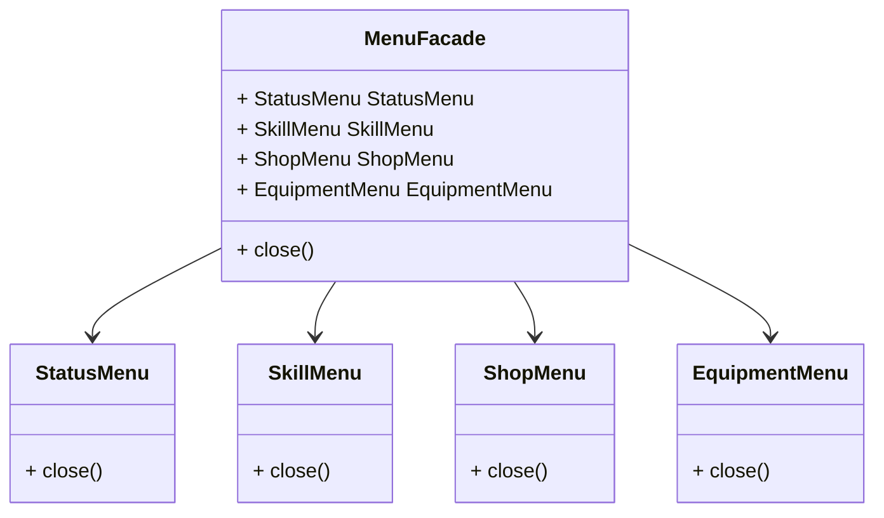

外观模式是一种**结构型**设计模式, 可以将一些零散的接口调用封装起来作为一个新的接口, 让调用者只需要调用一次, 就可以实现一些相对较为复杂的操作

## 外观模式的作用

* 减少系统的复杂性, 调用者需要知道的细节更少
* 灵活组合多种功能, 并且不需要修改原来的代码
* 提高安全性, 由于屏蔽了更多细节, 可能的错误调用会减少

## 外观模式适用于什么场景

外观模式的使用场景非常简单, 就是当你有多个比较复杂的操作时, 你不需要一个一个的去进行调用, 可以通过外观模式将这多个功能全部封装到同一个方法里面, 然后只需要调用这个封装过后的方法即可

比如说我有一个人物 `状态菜单`, `技能菜单`, `装备菜单`, `商城菜单`, 这四个菜单都有自己的单独的打开和关闭的功能, 但是当我把所有菜单都打开的时候, 如果我想要做关闭之类的操作, 我需要一个一个去点击它的关闭功能, 一个两个的可能还没什么问题, 四个看起来好像也可以接受, 但是如果菜单的数量更多, 那么一个一个的找起来点起来都相当的麻烦, 所以我们可以使用外观模式, 把这几个开关全部统一起来, 可以在一次关闭操作中把所有的页面全部关掉

## 类图



## 代码

```csharp
public class StatusMenu
{
    public void Close()
    {
        Console.WriteLine($"{GetType().Name} Closed");
    }
}
public class SkillMenu
{
    public void Close()
    {
        Console.WriteLine($"{GetType().Name} Closed");
    }
}
public class ShopMenu
{
    public void Close()
    {
        Console.WriteLine($"{GetType().Name} Closed");
    }
}
public class EquipmentMenu
{
    public void Close()
    {
        Console.WriteLine($"{GetType().Name} Closed");
    }
}
```

首先定义四个菜单, 每个菜单都有对应的 `Close` 方法

```csharp
public class MenuFacade
{
    public MenuFacade()
    {
        StatusMenu = new();
        SkillMenu = new();
        ShopMenu = new();
        EquipmentMenu = new();
    }
    public StatusMenu StatusMenu { get; }
    public SkillMenu SkillMenu { get; }
    public ShopMenu ShopMenu { get; }
    public EquipmentMenu EquipmentMenu { get; }
    public void Close()
    {
        StatusMenu.Close();
        SkillMenu.Close();
        ShopMenu.Close();
        EquipmentMenu.Close();
    }
}
```

然后再定义一个所谓的外观, 拥有一个统一调用了所有菜单 `Close` 方法的 `Close` 方法


