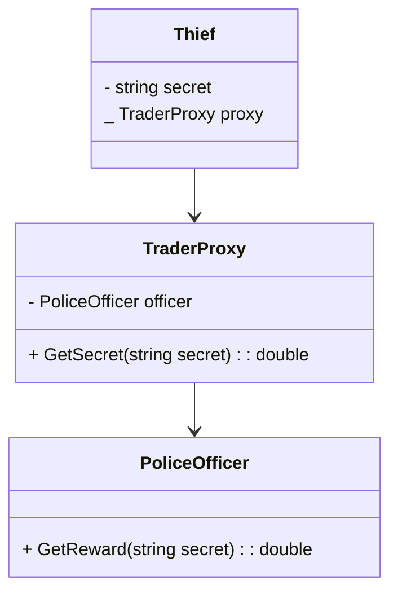

代理模式是一种**结构型**设计模式, 可以通过代理对象来操作真实的对象, 从而实现真实对象和使用者之间的隔离

## 代理模式的作用

* 控制对真实对象的访问, 增强数据安全性
* 提供额外的功能实现, 在访问真实对象前后可以进行额外的操作
* 提供统一接口, 屏蔽底层实现的变化, 方便使用者使用

## 代理模式适用于什么场景

这边举个例子, 一个 `盗贼` 想要领取 `治安官` 发布的悬赏, 但是他不能接触 `治安官`, 不然就会被抓, 此时他就需要一个中间人 `商人` 作为代理来帮他领取悬赏, 这就是代理模式的一个简单的应用了

## 类图



## 代码

```csharp
public class Thief
{
    private string secret;
    private TraderProxy traderProxy;
    public Thief(TraderProxy traderProxy) => (secret, this.traderProxy) = ("我有一个大秘密", traderProxy);
    public void GetReward()
    {
        Console.WriteLine($"获得了{traderProxy.GetSecret(secret)}元奖励");
    }
}
public class TraderProxy
{
    private PoliceOfficer policeOfficer;
    public TraderProxy(PoliceOfficer policeOfficer) => this.policeOfficer = policeOfficer;
    public double GetSecret(string secret)
    {
        var reward = policeOfficer.GetReward(secret) * 0.9;
        Console.WriteLine("作为中间商人抽10%");
        return reward;
    }
}
public class PoliceOfficer
{
    public double GetReward(string secret)
    {
        if (secret.Contains("秘密"))
        {
            Console.WriteLine("发布了10000元奖励");
            return 10000;
        }
        return 0;
    }
}
```

`PoliceOfficer` 收取秘密发布奖励, `TraderProxy` 可以帮 `Thief` 拿奖励, 但是期间会抽取 10% 的手续费

`Thief` 通过 `TraderProxy` 的代理拿到了 `PoliceOfficer` 的奖励


## 如何去使用

```csharp
var proxy = new TraderProxy(new PoliceOfficer());
var thief = new Thief(proxy);
thief.GetReward();
```

```txt
发布了10000元奖励
作为中间商人抽10%
获得了9000元奖励
```

