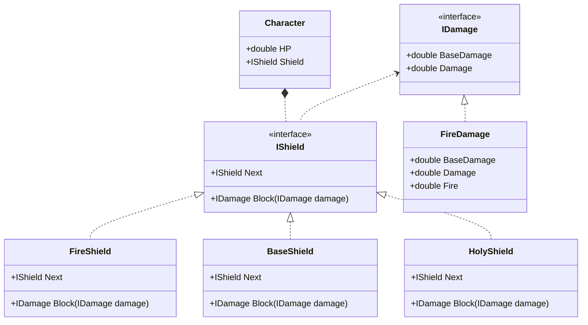

责任链模式是一种**行为型**设计模式, 可以将多个可以处理请求的对象组成一条链, 这个链上的每一个对象都有机会处理请求, 处理不了的就传递给下一个对象, 请求的发起者并不需要考虑太多东西, 只要发请求就行了

## 责任链模式的作用

* 降低耦合, 请求发送者和接收者之间没有关系, 只要发请求给链即可
* 简化代码设计, 方便扩展, 有了新的处理者之后只需要添加到链上就行了, 每个处理者都只负责处理某种特定场景

## 责任链模式适用于什么场景

比方说我们的`角色`套了几层`护盾`, 在受到`攻击`时可以使用`护盾`一层一层处理, 以此降低最终产生的`伤害`, 此时就可以将这些`护盾`组成一条链, 将`攻击`发给这个链, 处理之后得出最终的`伤害值`

## 类图



## 代码

首先定义`伤害`, `FireDamage` 是在基伤的上增加20%的火焰伤害

```csharp
public interface IDamage
{
    double BaseDamage { get; set; }
    double Damage { get; }
}
public class FireDamage : IDamage
{
    public double BaseDamage { get; set; } = 10;
    public double Damage => BaseDamage * (1 + Fire);
    public double Fire { get; set; } = 0.2;
}
```

然后定义几种`护盾`, 以`护盾`作为我们后期使用的责任链

```csharp
public interface IShield
{
    IShield Next { get; set; }
    IDamage Block(IDamage damage);
}
public class BaseShield : IShield
{
    public IShield Next { get; set; }
    public IDamage Block(IDamage damage)
    {
        damage.BaseDamage *= 0.9;
        if (Next == null || damage.Damage <= 0)
            return damage;
        return Next.Block(damage);
    }
}
public class FireShield : IShield
{
    public IShield Next { get; set; }
    public IDamage Block(IDamage damage)
    {
        if (damage is FireDamage fireDamage)
        {
            fireDamage.Fire *= 0.9;
            if (Next == null || fireDamage.Damage <= 0)
                return fireDamage;
            return Next.Block(fireDamage);
        }
        return damage;
    }
}
public class HolyShield : IShield
{
    public IShield Next { get; set; }
    public IDamage Block(IDamage damage)
    {
        damage.BaseDamage *= 0.5;
        if (Next == null || damage.Damage <= 0)
            return damage;
        return Next.Block(damage);
    }
}
```

不同的`护盾`会有不同的减伤机制, 也只会处理固定类型的`伤害`

```csharp
public class Character
{
    public IShield Shield { get; set; }
    public double HP { get; set; }
    public void BlockDamage(IDamage damage)
    {
        var blockedDamage = Shield.Block(damage);
        if (blockedDamage.Damage > 0)
            HP -= blockedDamage.Damage;
    }
}
```

在设计`角色`时只需要知道第一个`护盾`节点即可, `Block` 内部会自行判断是否需要继续传递

## 如何去使用

```csharp
var shieldChain = new BaseShield()
{
    Next = new FireShield()
    {
        Next = new HolyShield()
    }
};
var damage = new FireDamage();
var character = new Character() { HP = 100, Shield = shieldChain };
character.BlockDamage(damage);
```
