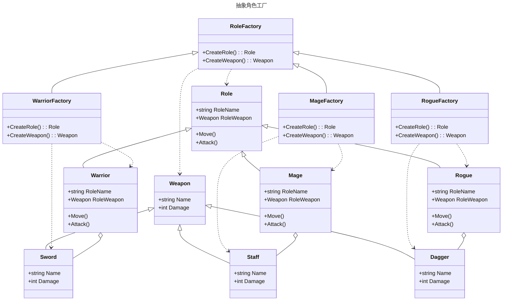

抽象工厂方法模式也是是一种**创建型**设计模式, 与上一篇的工厂模式类似, 不过区别在于抽象工厂模式用于创建一组有关联的对象

## 工厂方法模式的作用

[参考上一篇](./Factory#工厂方法模式的作用)

## 工厂方法模式适用于什么场景

[参考上一篇](./Factory#工厂方法模式适用于什么场景)

## 工厂方法和抽象工厂的区别

一般而言, 工厂模式只会创建一种类型的对象, 但是抽象工厂会创建一组对象, 其内部相对而言更加复杂一些, 对象之间可能也会存在关联

## 类图



## 代码

定义角色

```csharp
public abstract class Role
{
    protected Role(string RoleName) => this.RoleName = RoleName;
    public string RoleName { get; set; }
    public Weapon RoleWeapon { get; set; }
    public abstract void Move();
    public virtual void Attack() => Console.WriteLine($"{RoleName}使用{RoleWeapon.Name}进行攻击, 造成{RoleWeapon.Damage}点伤害");
}
public class Warrior : Role
{
    public Warrior() : base("战士") { }
    public override void Move() => Console.WriteLine($"{RoleName}开着野蛮冲锋跑路");
}
public class Mage : Role
{
    public Mage() : base("法师") { }
    public override void Move() => Console.WriteLine($"{RoleName}开着疾风术跑路");
}
public class Rogue : Role
{
    public Rogue() : base("盗贼") { }
    public override void Move() => Console.WriteLine($"{RoleName}开着潜行跑路");
}
```

定义武器

```csharp
public abstract class Weapon
{
    protected Weapon(string name, int damage)
    {
        Name = name;
        Damage = damage;
    }
    public string Name { get; set; }
    public int Damage { get; set; }
}
public class Sword : Weapon
{
    public Sword() : base("长剑", 10) { }
}
public class Staff : Weapon
{
    public Staff() : base("法杖", 15) { }
}
public class Dagger : Weapon
{
    public Dagger() : base("短剑", 5) { }
}
```

然后定义对应的角色工厂

```csharp
public abstract class RoleFactory
{
    public abstract Role CreateRole();
    public abstract Weapon CreateWeapon();
}
public class WarriorFactory : RoleFactory
{
    public override Role CreateRole() => new Warrior() { RoleWeapon = CreateWeapon() };
    public override Weapon CreateWeapon() => new Sword();
}
public class MageFactory : RoleFactory
{
    public override Role CreateRole() => new Mage() { RoleWeapon = CreateWeapon() };
    public override Weapon CreateWeapon() => new Staff();
}
public class RogueFactory : RoleFactory
{
    public override Role CreateRole() => new Rogue() { RoleWeapon = CreateWeapon() };
    public override Weapon CreateWeapon() => new Dagger();
}
```

## 如何去使用

```csharp
new 山洞副本(new MageFactory()).危险发生();

class 山洞副本
{
    private Role Player;
    private readonly RoleFactory factory;
    public 山洞副本(RoleFactory factory)
    {
        this.factory = factory;
        Init();
    }

    private void Init()
    {
        Console.WriteLine("开始初始化");
        Player = factory.CreateRole();
        Console.WriteLine($"成功加载 {Player.RoleName}");
    }

    public void 危险发生()
    {
        Console.WriteLine("出现大群野生篮球");
        foreach (var i in Enumerable.Range(0, Random.Shared.Next(10)))
            Player.Attack();
        Player.Move();
        if (DateTime.Now.DayOfWeek == DayOfWeek.Thursday)
        {
            Console.WriteLine("今天是逃不过的肯德基疯狂星期四，篮球得到了唱跳rap的buff加成");
            Console.WriteLine($"角色{Player.RoleName} 死亡，重新初始化");
            Init();
        }
        else
        {
            Console.WriteLine("成功逃脱了！");
        }
    }
}
```

抽象工厂模式和一般的工厂模式类似, 区别就是前者相比后者, 可以创建多个产品
