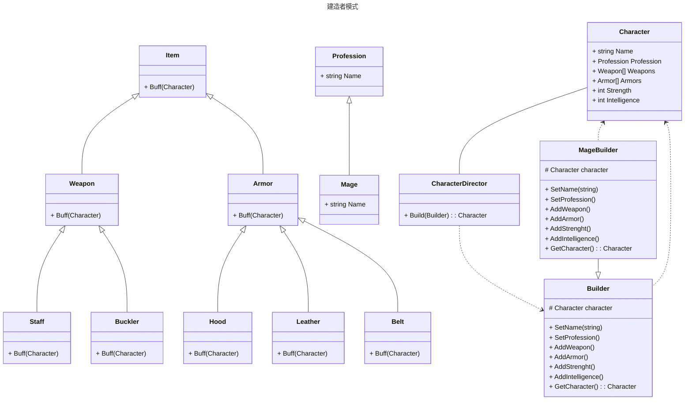
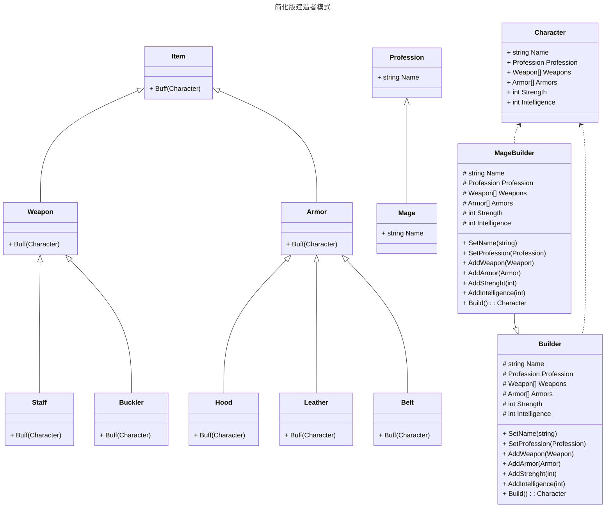

建造者模式是一种**创建型**的设计模式, 将一个对象的创建过程拆分成一个个小的部分, 每次决定其中的一个细节, 构建出一个复杂对象

对象的创建过程被拉长分散, 可能会经历一系列的复杂决策, 最终才会形成我们需要的对象

对象拥有多个参数, 或者拥有包含多个参数的构造函数, 通过建造者模式可以相对方便地构造对象

## 建造者模式的作用

* 通过拆分对象的创建步骤, 降低对象的构建复杂度, 使用者并不需要知道复杂对象的所有创建细节
* 由于拆分了对象的创建步骤, 可以有效降低构造对象时的心智负担
* 拆分出的建造者可以重复使用, 大大提高了代码的复用性

## 建造者模式适用于什么场景

当一个类的构造函数中有多个参数(一般大于四个), 并且这些参数中有些必填, 有些非必填, 使用建造者模式可以有效降低心智负担

例如需要创建一个角色, 这个角色有参数 `姓名` `职业` `武器` `防具` `力量` `智力` `等级` 等参数, 除了`姓名`之外的所有参数都是可选的

这种情况下使用建造者模式, 可以通过 `角色建造者` 类来一步一步设置这些参数, 最后调用 `创建角色` 方法生成角色对象

## 传统建造者模式的类图



## 代码

定义我们需要构造的 `Character`

```csharp
// 首先构造法师职业
public abstract class Profession
{
    public string Name { get; set; }
}
public class Mage : Profession
{
    public Mage()
    {
        Name = "法师";
    }
}
// 其次定义装备, 每个不同的装备可以给任务提供不同的Buff加成
public abstract class Item
{
    public abstract void Buff(Character character);
}
public abstract class Weapon : Item { }
public abstract class Armor : Item { }
public class Staff : Weapon
{
    public override void Buff(Character character)
    {
        character.Intelligence += 10;
    }
}
public class Buckler : Weapon
{
    public override void Buff(Character character)
    {
        character.Intelligence += 2;
        character.Strength += 5;
    }
}
public class Hood : Armor
{
    public override void Buff(Character character)
    {
        character.Intelligence += 5;
        character.Strength += 5;
    }
}
public class Leather : Armor
{
    public override void Buff(Character character)
    {
        character.Intelligence += 2;
        character.Strength += 15;
    }
}
public class Belt : Armor
{
    public override void Buff(Character character)
    {
        character.Intelligence += 15;
        character.Strength += 15;
    }
}
// 最后是一个简单的角色人物

public class Character
{
    public Character() { }
    public Character(Character character)
    {
        Name = character.Name;
        Profession = character.Profession;
        Weapons = character.Weapons;
        Armors = character.Armors;
        Strength = character.Strength;
        Intelligence = character.Intelligence;
    }
    public string Name { get; set; }
    public Profession Profession { get; set; }
    public List<Weapon> Weapons { get; set; }
    public List<Armor> Armors { get; set; }
    public int Strength { get; set; }
    public int Intelligence { get; set; }
}
```

然后定义人物的建造者 `builder`

```csharp
public abstract class Builder
{
    protected Character character;
    public abstract Builder SetName(string name);
    public abstract Builder SetProfession();
    public abstract Builder AddWeapon();
    public abstract Builder AddArmor();
    public abstract Builder AddStrength();
    public abstract Builder AddIntelligence();
    public abstract Character GetCharacter();
}
public class MageBuilder : Builder
{
    public MageBuilder(string name = null)
    {
        character = new Character();
        SetName(name).SetProfession();
    }
    public override Builder AddArmor()
    {
        List<Armor> armors = new List<Armor> { new Hood(), new Leather(), new Belt() };
        character.Armors ??= new List<Armor>();
        character.Armors.AddRange(armors);
        return this;
    }
    public override Builder AddIntelligence()
    {
        character.Intelligence++;
        return this;
    }
    public override Builder AddStrength()
    {
        character.Strength++;
        return this;
    }
    public override Builder AddWeapon()
    {
        List<Weapon> weapons = new List<Weapon> { new Staff(), new Buckler() };
        character.Weapons ??= new List<Weapon>();
        character.Weapons.AddRange(weapons);
        return this;
    }
    public override Character GetCharacter()
    {
        var result = new Character(character);
        result.Armors.ForEach(item => item.Buff(result));
        result.Weapons.ForEach(item => item.Buff(result));
        return result;
    }
    public override Builder SetName(string name)
    {
        character.Name = name;
        return this;
    }
    public override Builder SetProfession()
    {
        character.Profession = new Mage();
        return this;
    }
}
```

最后定义一个简单的装配类, 通过builder获取character

```csharp
public class CharacterDirector
{
    public Character Build(Builder builder)
    {
        return builder
                .AddWeapon()
                .AddArmor()
                .AddStrength()
                .AddIntelligence()
                .GetCharacter();
    }
}
```

## 如何去使用

```csharp
Builder builder = new MageBuilder();
builder.SetName("菜鸟法师");
CharacterDirector director = new CharacterDirector();
Character character1 = director.Build(builder);
// 精英法师多用点装备应该是正常的
builder.SetName("精英法师").AddIntelligence().AddStrength().AddArmor().AddWeapon();
Character character2 = director.Build(builder);
```

通过复用builder可以构造出不同属性的人物

## 简化版建造者

前面的建造者模式在实际使用的时候比较繁琐, 需要经历 `director` --> `builder` --> `character`

下面介绍一个简化版本的建造者, 省略掉 `director`, 直接在 builder 里完成构建

## 简化版类图



## 代码

只需要修改 `Builder` 部分, 然后移除 `CharacterDirector`

```csharp
public class MageBuilder : Builder
{
    public override Builder AddArmor(Armor armor)
    {
        Armors ??= new List<Armor>();
        Armors.Add(armor);
        return this;
    }
    public override Builder AddIntelligence(int intelligence)
    {
        Intelligence += intelligence;
        return this;
    }
    public override Builder AddStrength(int strength)
    {
        Strength += strength;
        return this;
    }
    public override Builder AddWeapon(Weapon weapon)
    {
        Weapons ??= new List<Weapon>();
        Weapons.Add(weapon);
        return this;
    }
    public override Builder SetName(string name)
    {
        Name = name;
        return this;
    }
    public override Builder SetProfession(Profession profession)
    {
        Profession = profession;
        return this;
    }
    public override Character Build()
    {
        var character = new Character()
        {
            Name = Name,
            Weapons = Weapons.ToList(),
            Armors = Armors.ToList(),
            Profession = Profession,
            Intelligence = Intelligence,
            Strength = Strength,
        };
        Weapons.ForEach(item => item.Buff(character));
        Armors.ForEach(item => item.Buff(character));
        return character;
    }
}
public abstract class Builder
{
    protected string Name;
    protected Profession Profession;
    protected List<Weapon> Weapons;
    protected List<Armor> Armors;
    protected int Strength;
    protected int Intelligence;
    public abstract Builder SetName(string name);
    public abstract Builder SetProfession(Profession profession);
    public abstract Builder AddWeapon(Weapon weapon);
    public abstract Builder AddArmor(Armor armor);
    public abstract Builder AddStrength(int strength);
    public abstract Builder AddIntelligence(int intelligence);
    public abstract Character Build();
}
```

简化版本的建造者有个好处, 每次构建出来都是一个新的对象, 不会影响到之前的对象, 这在一些使用引用的地方就非常友好了


## 如何使用简化版建造者

```csharp
Builder builder = new MageBuilder();
builder.SetName("菜鸟法师")
.SetProfession(new Mage())
.AddWeapon(new Staff())
.AddWeapon(new Buckler())
.AddArmor(new Hood())
.AddArmor(new Leather())
.AddArmor(new Belt());

var character1 = builder.Build();
builder.SetName("精英法师").AddStrength(100).AddIntelligence(100);
var character2 = builder.Build();
```
