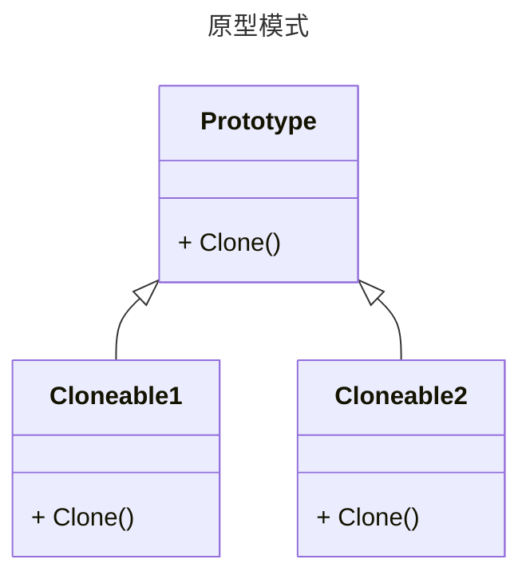

原型模式是一种**创建型**设计模式, 可以复制已有对象来产生一个新的对象

## 原型模式的作用

主要作用就是在程序的运行过程中复制已有的对象(一般是复制自己), 减少重新构建对象时可能会产生的额外开销

## 原型模式适用于什么场景

* 当对象的创建过程非常复杂, 创建的资源开销比较高时, 使用原型模式可以缓解
* 如果一个对象有 **114514** 个属性, 现在需要一个仅有个别属性不一样的新对象, 此时使用原型模式就比较方便了

## 类图




## 代码

```csharp
public class Prototype : ICloneable
{
    public object Clone()
    {
        return MemberwiseClone() as Prototype;
    }
}
public class Cloneable1 : Prototype
{
}
public class Cloneable2 : Prototype
{
}
```

## 如何去使用

```csharp
Cloneable1 data = new();
var newData = data.Clone() as Cloneable1;
```
