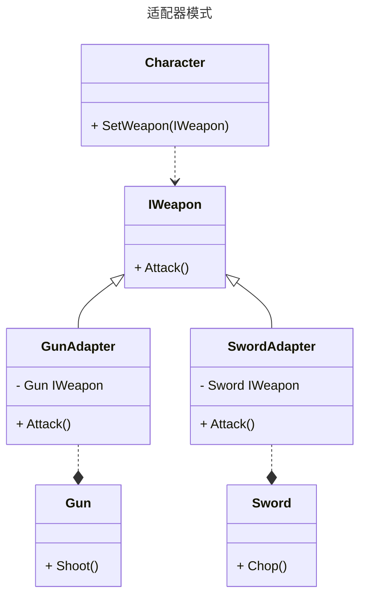

适配器模式是一种**结构型**的设计模式, 在开发过程中我们有的时候会用到一些类中的功能, 但是这个类是由团队的其他人写的, 并不一定匹配现有的接口, 直接修改这个类型可能会导致一些额外的麻烦, 并且还违反开闭, 此时使用适配器模式将这个类重新包装, 可以使其匹配已有的代码逻辑

## 适配器模式的作用

* 将一个类的接口转换成另一种接口, 使原本因接口不兼容而无法正常使用的类可以被现有的代码复用
* 可以将多个提供零散功能的类包装成可以兼容的接口
* 将目标类和适配者类解耦, 两者之间的交互全部通过适配器进行, 这样可以提高程序的透明性和可维护性
* 可以适应任何目标接口, 给程序结构带来灵活性, 使得目标类和适配者类可以独立变化

## 适配器模式适用于什么场景

需要复用一些现有的类, 但是现有的功能接口只能接收某种固定类型的输入, 此时修改这个功能很可能会带来意想不到的错误, 此时就可以使用适配器模式对这些现有类重新装配, 使其可以互相兼容

## 适配器模式的类图



## 代码

让 `GunAdapter` 和 `SwordAdapter` 实现 `IWeapon` 的 `Attack` 方法

在 `Attack` 中分别调用 `Gun` 和 `Sword` 的攻击方法

```csharp
public interface IWeapon
{
    void Attack();
}
public class Character
{
    private IWeapon _weapon;
    public void SetWeapon(IWeapon weapon)
    {
        _weapon = weapon;
    }
    public void Attack()
    {
        _weapon.Attack();
    }
}
// highlight-next-line
public class GunAdapter : IWeapon
{
    private readonly Gun gun;
    public GunAdapter(Gun gun)
    {
        this.gun = gun;
    }
    public void Attack()
    {
        // highlight-next-line
        gun.Shoot();
    }
}
// highlight-next-line
public class SwordAdapter : IWeapon
{
    private readonly Sword sword;
    public SwordAdapter(Sword sword)
    {
        this.sword = sword;
    }
    public void Attack()
    {
        // highlight-next-line
        sword.Chop();
    }
}
public class Gun
{
    public void Shoot()
    {
        Console.WriteLine("Big F**king Gun!");
    }
}
public class Sword
{
    public void Chop()
    {
        Console.WriteLine("Excalibur!");
    }
}
```

这样就通过 `GunAdapter` 和 `SwordAdapter` 实现了 `Gun` 和 `Sword` 到 `Weapon` 的适配

## 如何去使用

```csharp
Character character = new Character();
character.SetWeapon(new GunAdapter(new Gun()));
character.Attack();
character.SetWeapon(new SwordAdapter(new Sword()));
character.Attack();
```

上面的代码就通过 `适配器` 将原本毫无关联的 `Gun` 和 `Sword` 都当成 `Weapon` 一样使用, 并且并不需要修改三者的代码, 他们通过 `适配器` 项目关联起来
