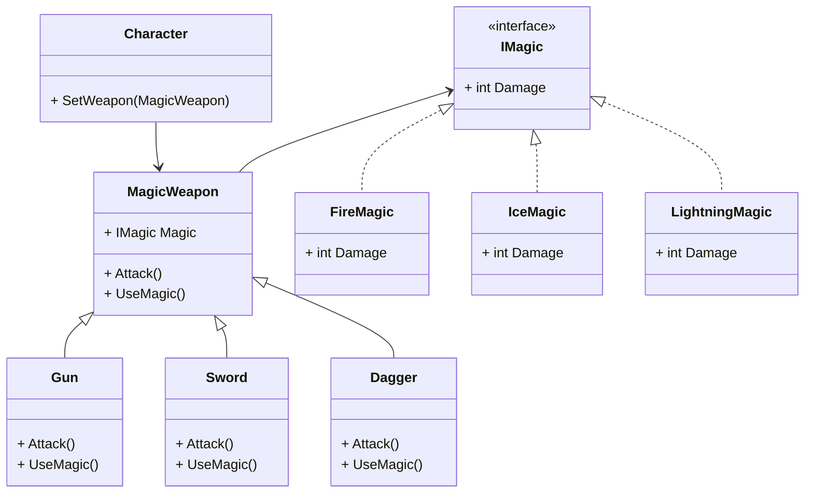

桥接模式是一种**结构型**的设计模式, 可以使类中的两个或两个以上的维度独立变化, 通过依赖抽象使得抽象与实现的修改互不影响

## 桥接模式的作用

* 分离抽象部分和实现部分, 使它们可以独立变化, 通过组合关系连接起来, 避免抽象和实现的继承耦合
* 提高系统的可扩展性, 可以根据需要扩展抽象部分或者实现部分
* 减少需要实现的子类的个数

## 桥接模式适用于什么场景

当某个类有多个可变化的维度时, 可以考虑使用桥接模式, 例如我需要给人物装备一件魔法武器, 假设原本存在三种武器和三种魔法效果, 如果只是做类似 `火焰剑` 或者 `火焰匕首` 的实现, 最终需要实现 **九个** 类, 但是通过桥接模式可以只实现 **六个**, 并且武器部分和魔法效果的部分时独立开来实现的, 相对来说耦合会降低很多

## 类图



## 代码

首先定义几个简单的魔法效果, 有 `火焰` `雷电` `冰霜`

```csharp
public interface IMagic
{
    int Damage { get; set; }
}
public class FireMagic : IMagic
{
    public int Damage { get; set; } = 10;
}
public class LightningMagic : IMagic
{
    public int Damage { get; set; } = 11;
}
public class IceMagic : IMagic
{
    public int Damage { get; set; } = 12;
}
```

然后是几种不同的武器, `剑` `枪` `匕首`

```csharp
public abstract class MagicWeapon
{
    protected MagicWeapon(IMagic magic) => Magic = magic;
    public IMagic Magic { get; }
    public abstract void Attack();
    public abstract IMagic UseMagic();
}
public class Dagger : MagicWeapon
{
    public Dagger(IMagic magic) : base(magic) { }
    public override void Attack() => Console.WriteLine("Dagger");
    public override IMagic UseMagic() => Magic;
}
public class Gun : MagicWeapon
{
    public Gun(IMagic magic) : base(magic) { }
    public override void Attack() => Console.WriteLine("Gun");
    public override IMagic UseMagic() => Magic;
}
public class Sword : MagicWeapon
{
    public Sword(IMagic magic) : base(magic) { }
    public override void Attack() => Console.WriteLine("Sword");
    public override IMagic UseMagic() => Magic;
}
```

这些武器在构造函数中接收一个魔法效果, 从而组合出 `火焰剑` 或者 `火焰匕首` 这种效果

:::tip
即使添加了新的魔法效果或者武器, 也只需要添加相同数量的类, 比如哪天多了个 `毒素` 效果, 只需添加一个 `毒素` 魔法类即可, 不需要再额外构建 `毒剑` `毒枪` 这种武器, 相比起来可是方便了不知道多少倍
:::

然后定义一个角色去使用魔法武器

```csharp
public class Character
{
    private MagicWeapon weapon;
    public Character(MagicWeapon weapon) => this.weapon = weapon;
    public void Attack() => weapon.Attack();
    public void UseMagic() => weapon.UseMagic();
}
```

## 如何去使用

```csharp
Character character = new Character(new Gun(new IceMagic()));
character.Attack();
character.UseMagic();
```

如上就给一个角色装备了一把 `寒冰枪`
