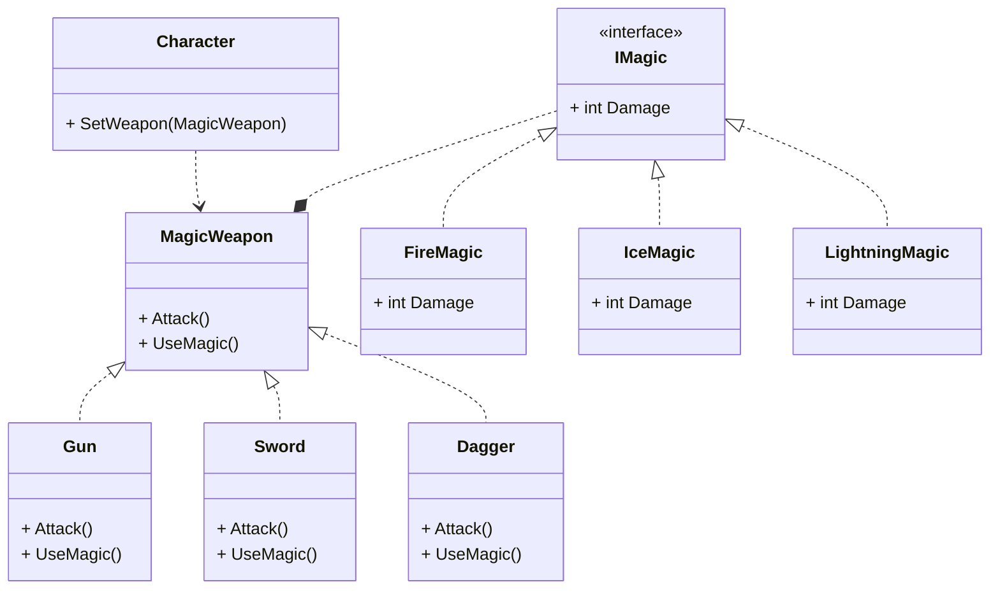

桥接模式是一种**结构型**的设计模式, 可以使类中的两个或两个以上的维度独立变化, 通过依赖抽象使得抽象与实现的修改互不影响

## 桥接模式的作用

* 分离抽象部分和实现部分, 使它们可以独立变化, 通过组合关系连接起来, 避免抽象和实现的继承耦合
* 提高系统的可扩展性, 可以根据需要扩展抽象部分或者实现部分
* 减少需要实现的子类的个数, 

## 桥接模式适用于什么场景

当某个类有多个可变化的维度时, 可以考虑使用桥接模式, 例如我需要给人物装备一件魔法武器, 假设原本存在三种武器和三种魔法效果, 如果只是做类似 `火焰剑` 或者 `火焰匕首` 的实现, 最终需要实现 **九个** 类, 但是通过桥接模式可以只实现 **六个**, 并且武器部分和魔法效果的部分时独立开来实现的, 相对来说耦合会降低很多

## 类图

