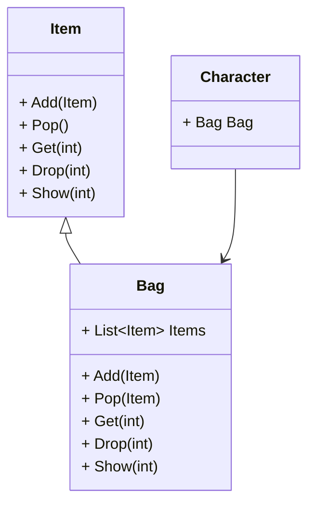

组合模式是一种**结构型**的设计模式, 这个模式会把对象组合成一个树状结构, 树枝和树叶使用统一的接口进行定义, 暴露给用户的行为看起来是完全一致的, 使用时不需要去考虑持有的对象到底是树枝还是树叶, 两者允许使用的操作都是一样的

## 组合模式的作用

* 将对象组合成树状结构
* 使单个对象和组合对象的操作一致, 简化处理

## 组合模式适用于什么场景

组合模式适用于需要将对象组装为树状结构的场景, 比如`背包`和`物品`之间的关系, `背包`里面可以放`物品`, 也可以放入其他的`背包`, 就像我喜欢在赫拉迪克方块里面放一堆捡到的垃圾玩意儿

在这样的场景下赫拉迪克方块也是一个`背包`

## 类图



## 代码

```csharp
class Character
{
    public Bag Bag { get; set; }
    public Character() => Bag = new Bag("root");
}
class Item
{
    public string Name { get; }
    public Item(string Name) => this.Name = Name;
    public virtual void Add(Item item) { }
    public virtual Item Pop() => this;
    public virtual Item Get(int i) => this;
    public virtual void Drop(int i) { }
    public virtual void Show(int level = 0) => Console.WriteLine("".PadLeft(level, '-') + Name);
}
class Bag : Item
{
    public List<Item> Items { get; private set; }
    public Bag(string Name) : base(Name) => Items = new List<Item>();
    public override void Add(Item item) => Items.Add(item);
    public override Item Get(int i) => Items[i];
    public override Item Pop()
    {
        var item = Items.Last();
        Items.Remove(item);
        return item;
    }
    public override void Drop(int i) => Items.RemoveAt(i);
    public override void Show(int level = 0)
    {
        base.Show(level);
        foreach (var item in Items)
            item.Show(level + 1);
    }
}
```

`Character`拥有一个背包`Bag`, 背包中有个 `Items`, 可以往里面添加物品, 也可以添加背包


## 如何去使用

```csharp
Character character = new Character();
Bag bag = new Bag("赫拉迪克方块");
bag.Add(new Item("皮手套"));
bag.Add(new Item("轻微治疗药剂"));
character.Bag.Add(bag);
character.Bag.Add(new Item("轻微法力药剂"));
character.Bag.Show();
```

如上可以往赫拉迪克方块里面放点随便捡到的垃圾, 然后再把方块放进正常的背包里

调用 `Show` 方法展示背包物品


```txt
root
-赫拉迪克方块
--皮手套
--轻微治疗药剂
-轻微法力药剂
```
