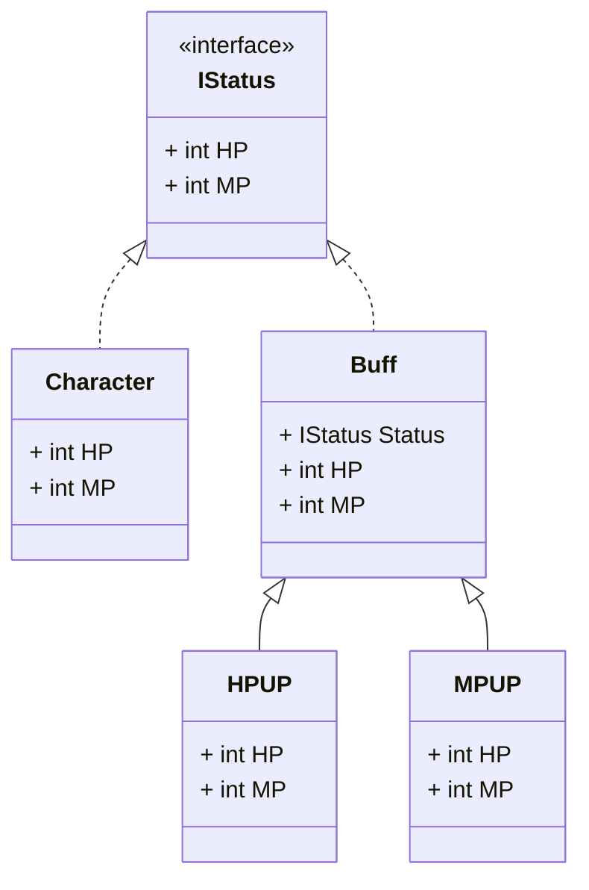

装饰模式是一种**结构型**设计模式, 可以动态地给实例对象添加新的功能, 而不需要修改原来的代码, 可以比较灵活地组合多种功能

## 装饰模式的作用

* 为已存在的实例对象添加新的功能实现
* 灵活组合多种功能
* 减少继承层次

## 装饰模式适用于什么场景

当需要对一个实例对象进行某种修改, 比起通过零碎的操作进行修改, 使用预设的装饰器可能会是个更加合适的方式, 例如将某个基础的`角色`**装饰**为战士或者法师, 然后在装饰的过程中给予部分属性的加成, `Buff`之类的可以做类似的处理

## 类图



## 代码

```csharp
public interface IStatus
{
    int HP { get; }
    int MP { get; }
}
public abstract class Buff : IStatus
{
    protected Buff(IStatus status) => Status = status;
    public IStatus Status { get; protected set; }
    public virtual int HP => Status.HP;
    public virtual int MP => Status.MP;
}
public class Character : IStatus
{
    public Character()
    {
        HP = 10;
        MP = 10;
    }
    public int HP { get; }
    public int MP { get; }
}
public class HPUP : Buff
{
    public HPUP(IStatus status) : base(status) { }
    public override int HP => Status.HP + 100;
}
public class MPUP : Buff
{
    public MPUP(IStatus status) : base(status) { }
    public override int MP => Status.MP + 100;
}
```

每个 `Buff` 接收一个 `IStatus` 参数, 一般来说会直接传入一个 `Character`, 然后不同的Buff会对传入的 `Character` 做一些属性上的增减

## 如何去使用

```csharp
IStatus status = new Character();
status = new HPUP(status);
status = new MPUP(status);
```

使用不同的 `Buff` 对象即可修改 `status` 的血量和蓝量

