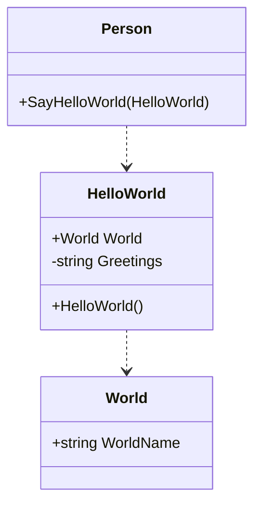
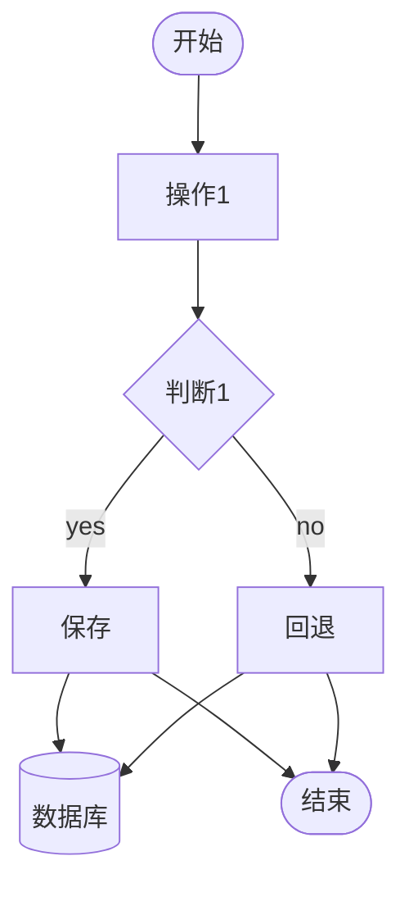
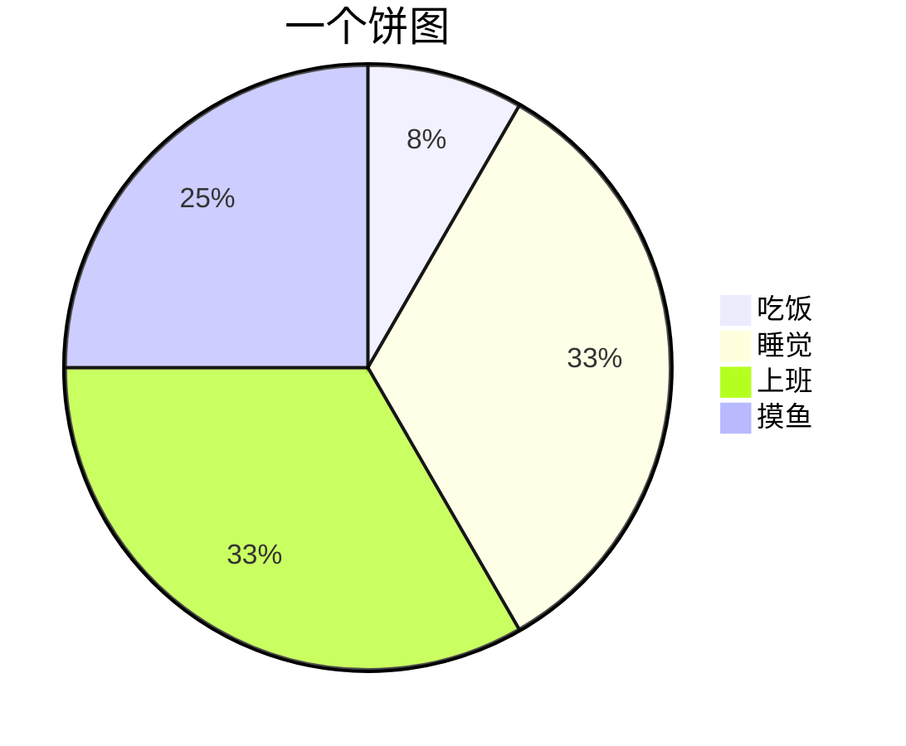

markdown 画图可以参考 [美人鱼 mermaid](https://mermaid-js.github.io/mermaid/#/)

mermaid需要将具体内容使用标有**mermaid**的代码块包裹起来

```txt
```mermaid
```

## 类图

```text
classDiagram

class Person{
    +SayHelloWorld(HelloWorld)
}
class HelloWorld{
    +World World
    -string Greetings
    +HelloWorld()
}
class World{
    +string WorldName
}

Person ..> HelloWorld
HelloWorld ..> World
```



## 流程图

```txt
flowchart TD
    start([开始])
    finish([结束])
    func1[操作1]
    cond1{判断1}
    savedata[保存]
    rollback[回退]
    db[(数据库)]
    savedata-->db
    rollback-->db
    start-->func1-->cond1-->|yes|savedata-->finish
    cond1-->|no|rollback-->finish
```



## 饼图

```txt
pie title 一个饼图
"吃饭" : 2
"睡觉" : 8
"上班" : 8
"摸鱼" : 6
```




